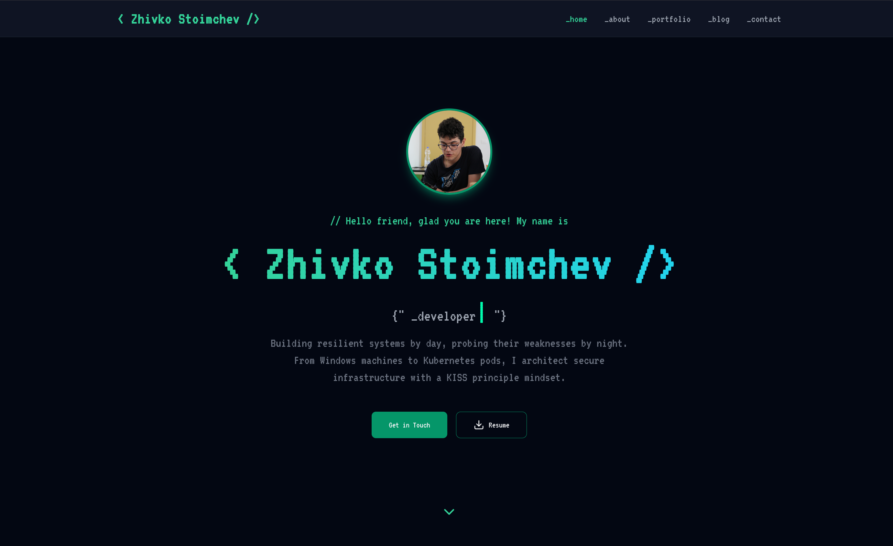

# Zhivko's Personal Portfolio

This repository contains the source code for my **personal portfolio website**, built to showcase my projects, skills, and experience as a developer.

The entire project — including design, architecture, and code — is **my own work**.

Projects are fetched dynamically from my MySQL database and displayed through a custom-built, animated portfolio carousel, making the content easy to maintain and update.

> ⚠️ **Important:** This project is **not a template**. The design, code, data structure, and deployment are my own work and are **not intended for reuse or redeployment by others** without my explicit permission.


## 🚀 Live Website
- **Production:** https://zstoimchev.com
- **Hosting:** Vercel
- **Custom Domain & DNS:** Cloudflare 


## 📸 Screenshots

> Preview of the live portfolio website



[//]: # (![Portfolio Section]&#40;./screenshots/portfolio.png&#41;)


## ✨ Features
- Fully responsive layout (desktop, tablet, mobile)
- Dynamic projects fetched from database
- Infinite carousel slider for featured projects
- Pause-on-hover carousel behavior
- Manual navigation (prev / next buttons)
- Project cards with:
    - Image preview
    - Description
    - Technologies used
    - GitHub links
- Smooth animations and transitions
- Optimized fonts and assets


## 🛠 Tech Stack

### Frontend
- **Next.js** (Pages Router)
- **React**
- **TypeScript**
- **Tailwind CSS**
- **Lucide React Icons**

### Backend / API
- **Next.js API Routes**
- **MySQL**

### Database
- **db4free.net** (MySQL hosting)

### Hosting & Infrastructure
- **Vercel** (Application hosting)
- **Cloudflare** (Custom domain, DNS, security)

### Fonts & UI
- **next/font** for font optimization
- Custom animations and transitions with Tailwind CSS


## 🧩 Project Structure
- `pages/` - Application pages and API routes
- `pages/api/` - Backend API endpoints
- `components/` - Reusable UI components
- `styles/` - Global and component styles
- `public/` - Static assets


## 🧪 Getting Started (Local Development)

To run this project locally:

```bash
# Clone the repository
$ git clone https://github.com/zstoimchev/portfolio.git
# Install dependencies
$ npm install
# Start the development server
$ npm run dev
```

Open http://localhost:3000 in your browser.

> ⚠️ Note: The project relies on a private MySQL database.
Without proper environment variables and database access, project data will not load locally.

### Environment Variables

This project uses environment variables for database access (not included in this repository):

```bash
DATABASE_URL=
DATABASE_USER=
DATABASE_PASSWORD=
DATABASE_NAME=
DATABASE_HOST=
DATABASE_PORT=
EMAIL_USER=
EMAIL_PASS=
BLOB_READ_WRITE_TOKEN=
```

These values are configured securely in **Vercel Environment Variables**.


## 📦 Deployment
- Production Hosting: Vercel
- Custom Domain: Managed via Cloudflare
- The application is automatically built and deployed on every push to the main branch.


## 📜 License & Usage

**© 2026 Zhivko Stoimchev. All rights reserved.**

This project and its source code are **private**. Copying, modifying, or deploying this project **without explicit permission** is **strictly prohibited**.

If you are interested in collaboration or have questions, feel free to reach out.


## 📬 Contact

If you want to get in touch regarding this project or potential collaboration, feel free to reach out:

- 📧 Email: [zstoimchev@gmail.com](mailto:zstoimchev@gmail.com)
- 💼 LinkedIn: https://www.linkedin.com/in/zhivko-stoimchev/
- 🧑‍💻 GitHub: https://github.com/zstoimchev


---

Thank you for checking out my work! 🚀